```mermaid
flowchart TD
    classDef human   fill:#dbeafe,stroke:#3b82f6,color:#1e3a5f
    classDef cmd     fill:#dcfce7,stroke:#22c55e,color:#14532d
    classDef art     fill:#fef9c3,stroke:#ca8a04,color:#713f12
    classDef gate    fill:#fce7f3,stroke:#ec4899,color:#831843
    classDef start   fill:#f3e8ff,stroke:#a855f7,color:#3b0764
    classDef danger  fill:#fee2e2,stroke:#ef4444,color:#7f1d1d

    %% ── START ─────────────────────────────────────────────
    S(["START\nHuman provides:\ntask type and scope description"]):::start

    S --> SCOUT

    %% ── SCOUT ─────────────────────────────────────────────
    SCOUT["⚡ /scout\nDeep-reads named scope\nNo solutions, no code"]:::cmd
    SCOUT --> R020[/"020-research.md"\]:::art
    R020 --> H_R{"👤 Review research\n---\nApprove or ask for\nmore depth"}:::gate

    H_R -->|"needs more depth"| SCOUT
    H_R -->|"bug / refactor\nchore / perf"| DESIGN
    H_R -->|"feat_"| CHARTER

    %% ── STANDARD PATH ────────────────────────────────────
    subgraph STD ["  Standard Workflow  "]
        direction TB
        DESIGN["⚡ /design\nReads research + source files\nWrites plan with acceptance\ncriteria and todo list"]:::cmd
        DESIGN --> P040[/"040-plan.md"\]:::art
        P040 --> H_A{"👤 Annotate plan\n---\nAdd **NOTE:** inline\nfor corrections,\nconstraints, redirects\nRepeat until correct"}:::gate
        H_A -->|"address notes"| DESIGN
        H_A -->|"APPROVED"| FORGE

        FORGE["⚡ /forge\nImplements all plan todos\nRuns build check after each unit\nMarks todos complete in plan"]:::cmd
        FORGE --> AUDIT

        AUDIT["⚡ /audit\nReads ACs and changed files\nRuns build + skill checks\nAdversarial subagent reviewer\nnever sees implementation rationale"]:::cmd
        AUDIT --> V060_S[/"060-verification.md"\]:::art
    end

    V060_S --> H_VS{"👤 Review verdict\n---\nApprove seal or\ndirect a fix"}:::gate
    H_VS -->|"FAIL"| FORGE
    H_VS -->|"PASS or\nPASS WITH NOTES"| SEAL

    %% ── CR-AW PATH ───────────────────────────────────────
    subgraph CRAW ["  CR-AW Extension — feat_ tasks  "]
        direction TB

        CHARTER["⚡ /charter\nReads research + source\nWrites SPEC with P0 / P1 / P2\nacceptance criteria"]:::cmd
        CHARTER --> S025[/"025-spec.md"\]:::art
        S025 --> H_SPEC{"👤 APPROVE SPEC\nChinese Wall Gate\n---\nNothing proceeds\nuntil this is signed off\nRevisions restart charter"}:::gate
        H_SPEC -->|"revise"| CHARTER

        H_SPEC -->|"APPROVED"| PAR

        subgraph PAR ["  Parallel after SPEC approval  "]
            direction LR
            CHALLENGE["⚡ /challenge\nRed Team\nWorktree isolated\nSource dirs deleted\nReads SPEC only\nWrites verification suite"]:::cmd
            BLUEPRINT["⚡ /blueprint\nReads SPEC + suite + source\nDesigns architecture to\nsatisfy both\nFlags any spec vs test conflict"]:::cmd
        end

        CHALLENGE --> T030[/"030-verification-suite"\]:::art
        BLUEPRINT --> P040B[/"040-plan.md"\]:::art

        T030 --> H_BOTH{"👤 Review BOTH together\n---\nPlan and test suite must\nbe approved jointly\nAnnotate plan with NOTE:\nRevise either if needed"}:::gate
        P040B --> H_BOTH

        H_BOTH -->|"revise plan"| BLUEPRINT
        H_BOTH -->|"APPROVED"| CRAFT

        CRAFT["⚡ /craft\nGreen Team\nWorktree isolated\nTest dirs deleted\nReads SPEC + PLAN + report\nRuns build check each unit"]:::cmd
        CRAFT --> SCORE

        SCORE["⚡ /score\nOrchestrator runs suite\nSanitizes output before\nGreen Team sees it\nStrips expected values,\nfile paths, line numbers"]:::cmd
        SCORE --> R050[/"050-test-report-N"\]:::art

        R050 --> THRESH{"P0 = 100%?\nP1 >= 90%?\nP2 >= 70%?"}:::gate
        THRESH -->|"No — Green Team\ngets sanitized report\nand iterates"| CRAFT
        THRESH -->|"Yes"| CERTIFY

        CERTIFY["⚡ /certify\nReads SPEC + PLAN + impl\nVerifies each P0 AC\nwith file:line citation\nRuns skill quality checks"]:::cmd
        CERTIFY --> V060_C[/"060-verification.md"\]:::art
    end

    V060_C --> H_VC{"👤 Review verdict\n---\nApprove seal or\ndirect a fix"}:::gate
    H_VC -->|"FAIL — major"| H_SPEC
    H_VC -->|"FAIL — minor"| CRAFT
    H_VC -->|"PASS or\nPASS WITH NOTES"| SEAL

    %% ── SEAL ──────────────────────────────────────────────
    SEAL["⚡ /seal\nMoves all task artifacts\nto docs/artifacts/archive\nMarks COMPLETE in registry"]:::cmd
    SEAL --> DONE(["DONE"]):::start

    %% ── ONE-TIME SETUP (human) ───────────────────────────
    SETUP["⚠️ One-time human setup\nbefore first feat_ task:\nCreate CR-AW test target\nin Xcode UI\nSee active skill for steps"]:::danger
    SETUP -.->|"required for /score\nto run tests"| SCORE
```

# Workflow Diagram — CR-AW Unified Pipeline

**Commands:** `/scout` `/design` `/forge` `/audit` `/seal` (standard)
**CR-AW:** `/charter` `/challenge` `/blueprint` `/craft` `/score` `/certify`

---



---

## What the Human Provides at Each Step

| Step | Human provides |
|------|---------------|
| **Start** | Task type (`feat_` / `bug_` / `refactor_` / `chore_` / `perf_`) and scope description (files, subsystem, or feature name) |
| **After `/scout`** | Approval that research is sufficient, OR direction to go deeper, OR task-type routing decision |
| **After `/charter`** | SPEC approval — this is the Chinese Wall gate. Nothing in the CR-AW path starts until this is signed off. |
| **After `/challenge` + `/blueprint`** | Joint approval of plan AND test suite together. Inline `**[NOTE: ...]**` annotations on the plan doc. |
| **After `/design`** | Inline `**[NOTE: ...]**` annotations on the plan doc. Explicit "approved" message when correct. |
| **After `/audit` or `/certify`** | Final verdict review. Approval to seal, or direction on what to fix. |
| **One-time setup** | Create the CR-AW test target in Xcode UI before the first `feat_` task (see active skill). |

---

## Command Quick Reference

| Command | Stage | Path | Isolation |
|---------|-------|------|-----------|
| `/scout` | Research | Both | — |
| `/charter` | Spec gate | CR-AW only | — |
| `/challenge` | Red Team tests | CR-AW only | Worktree — source dirs deleted |
| `/blueprint` | CR-AW plan | CR-AW only | — |
| `/design` | Plan | Standard only | — |
| `/forge` | Implement | Standard only | — |
| `/craft` | Green Team implement | CR-AW only | Worktree — test dirs deleted |
| `/score` | Sanitized test report | CR-AW only | — |
| `/audit` | Verify | Standard only | Adversarial subagent |
| `/certify` | CR-AW final audit | CR-AW only | — |
| `/seal` | Archive | Both | — |

---

## Artifact Sequence

**Standard task:**
```
020-research.md  →  040-plan.md  →  060-verification.md  →  [archive]
```

**Feature task (CR-AW):**
```
020-research.md  →  025-spec.md  →  030-verification-suite
                                  →  040-plan.md
                                         ↓
                              050-test-report-1.md
                              050-test-report-2.md  (if iteration needed)
                                         ↓
                              060-verification.md  →  [archive]
```
